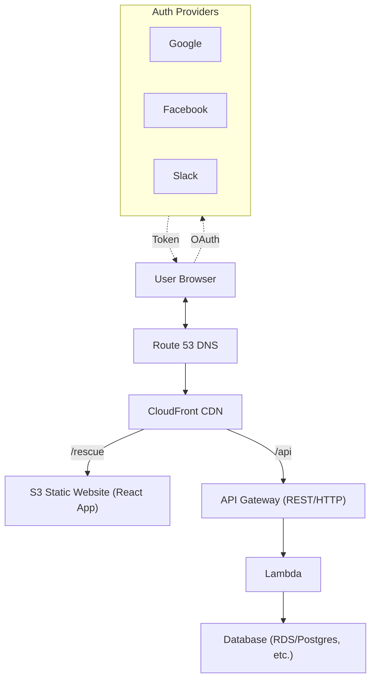
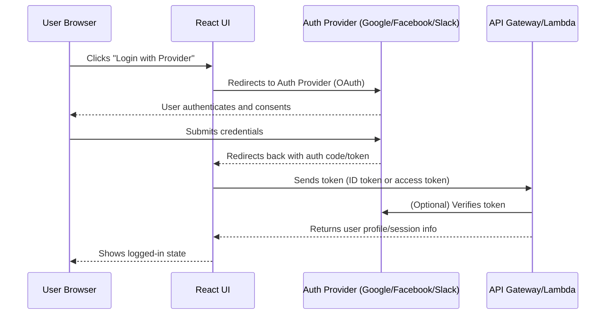

# Dogs.net Cloud Architecture

## Sequence Diagram: Login with Auth Provider

## Flow
- User visits `www.dogs.net` or `www.dogs.net/rescue` → DNS (Route 53) → CloudFront → S3 static site.
- User visits `www.dogs.net/api/*` → DNS (Route 53) → CloudFront → API Gateway → Lambda.
- Lambda can access databases or other AWS services as needed.

## Key Points
- CloudFront routes `/api/*` to API Gateway, all other paths to S3.
- S3 bucket can have public access only for certain prefixes (e.g., `/rescue`).
- API Gateway has CORS enabled for frontend AJAX.
- SSL/TLS via AWS Certificate Manager on CloudFront and API Gateway.

---

If you want a visual diagram, you can use this layout in draw.io, Lucidchart, or Mermaid for rendering.

## Why Use a CDN (CloudFront) with S3 Static Hosting?

While S3 object URLs support HTTPS, the S3 static website hosting endpoint is HTTP-only and does not natively support HTTPS or custom domains. Using a CDN like AWS CloudFront in front of your S3 static site provides several key benefits:

- **HTTPS Support:** CloudFront enables secure HTTPS access to your static site, which is required for modern browsers and best security practices.
- **Custom Domains:** You can use your own domain (e.g., www.dogs.net) with SSL certificates managed by AWS Certificate Manager.
- **Global Caching:** CloudFront caches your static assets at edge locations worldwide, improving load times for users everywhere.
- **DDoS Protection & Security:** CloudFront adds an extra layer of security and protection against attacks.

For production-grade static sites, CloudFront is the recommended way to serve your React app from S3 with HTTPS and a custom domain.

---
## Steps

### Step 1: TBD 
#### Cost

### Step 2: Register a Domain and Set Up Route 53 DNS

1. Go to the AWS Route 53 console.
2. Click “Registered domains” → “Register domain.”
3. Search for your desired domain (e.g., dogs.net), add to cart, and complete the purchase.
4. Route 53 will automatically create a hosted zone for your domain.
5. In the hosted zone, add DNS records (A, CNAME, etc.) to point to your S3/CloudFront/API endpoints.
6. Use AWS Certificate Manager to request an SSL certificate for your domain (for HTTPS).

Your domain will now be managed by Route 53, and you can control DNS for all your AWS resources.

#### Cost

- **Domain registration:** Typically $10–$15 USD per year for most .com/.net domains (premium domains may cost more).
- **Route 53 hosted zone:** $0.50 USD per month per hosted zone.
- **DNS queries:** First 1 million queries/month are $0.40, but for most small sites, this is just a few cents per month.
- **AWS Certificate Manager (SSL):** Free for public certificates used with AWS services (CloudFront, API Gateway, etc.).

So, expect about $11–$16 USD for the first year, then ~$11–$16 per year after that, plus minimal DNS query charges. SSL/TLS certificates via ACM are free when used with AWS resources.

### Step 3: TBD 
#### Cost

### Step 4: TBD 
#### Cost